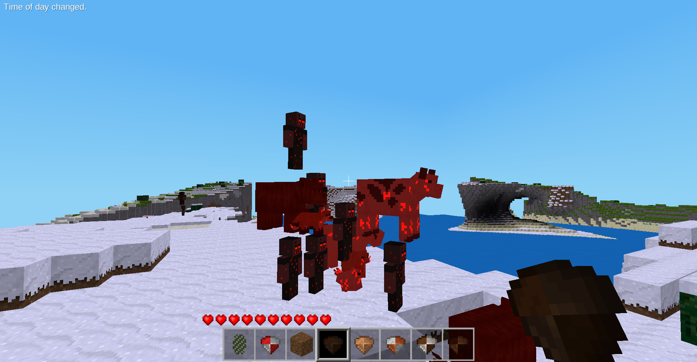

# Infectious

Apocalyptic zombie mod for Luanti. Aggressive zombies roam the night, infect animalia mobs on contact, and spread the horde. Includes bosses, brutes, and blood moon integration.



## Zombies

- **Humanoid zombie** — dark, bloody player model. Fast, aggressive, attacks everything
- **17 zombified animals** — every animalia mob has an infected variant with darkened textures and red eyes
- **Infection** — 30% chance on each hit to zombify the target mob
- **Night/dark spawning** — spawn where light level is 7 or lower, in packs of 1-3
- **Sunlight immune** — don't burn in daylight once spawned
- **Minecraft-style spawning** — spawns around players, despawns at 120+ blocks

## Brute

- **80 HP**, 40% damage reduction, 12 damage with area sweep
- 1.5x player-sized with steel armor and amber eyes
- Not zombie-tagged — zombies will attack it, it fights back
- **Can be infected** — becomes an Infected Brute (120 HP, 16 damage, zombie speed, 60% armor, 95% during blood moon)
- Rare natural spawn (1 in 15 chance instead of zombie)
- Drops steel ingots, rare brute mace (1 in 10), diamonds

### Brute Mace (dropped weapon)
- 10 damage, area damage on hit, 150 durability

## Bosses

Bosses drop elemental tridents. They spawn naturally (rare) at any light level, and announce their presence to players within 128 blocks.

| Boss | HP | Damage | Armor | Size | Speed | Drop |
|------|-----|--------|-------|------|-------|------|
| **Inferno Titan** | 600 | 21 | 60% | 4x | Very slow | Fire Trident |
| **Storm Colossus** | 540 | 24 | 27.5% | 4x | Normal | Lightning Trident |
| **Void Reaper** | 200 | 27 | None | 1x | Very fast | Wither Trident |
| **Life Warden** | 750 | 15 | 32.5% | 4x | Normal | Support Trident |

### Inferno Titan
- Obsidian and magma skin with glowing cracks and fire eyes
- 4x player size, very slow (1.5 speed) but massive reach (7 blocks) and area damage (10 blocks)
- **Fire immune** — burn DOT is always cleansed
- **Passive fire aura** — damages all nearby entities on a timer with fire particles
- **4-phase enrage system** as HP drops:

| Phase | HP % | Armor | Speed | Damage | Attack Speed | Reach | AOE | Aura |
|-------|------|-------|-------|--------|-------------|-------|-----|------|
| 1 | 100-76% | 60% | 1.5 | 21 | 1.2s | 7 | 10 | 5 dmg / 5 blocks / 4s |
| 2 | 75-51% | 75% | 1.5 | 21 | 1.2s | 7 | 10 | 10 dmg / 10 blocks / 3s |
| 3 | 50-26% | 85% | 3.0 | 31 | 0.8s | 10 | 15 | 15 dmg / 15 blocks / 2s |
| 4 | 25-0% | 90% | 4.5 | 47 | 0.53s | 15 | 20 | 20 dmg / 20 blocks / 1s |

- **Wither immune** below 75% HP
- Attacks set targets on fire with burst particles

### Void Reaper
- Player-sized, black body with purple energy veins and white glowing eyes
- Moves as fast as bloodmoon-buffed zombies, attacks every 0.4 seconds
- **Single target** — no area damage, but applies **stacking wither**
- Each hit adds 1 wither stack (max 10), each stack deals 2 true damage (bypasses armor)
- Higher stacks = faster tick rate (0.5s at 1 stack, 0.05s at 10 stacks)
- Stacks reset after 3 seconds of no hits
- Spawn rate doubled at night, tripled during blood moon

### Other Bosses
- Area damage (radius scales with boss size)
- No knockback — they don't flinch
- Immune to infection

## Blood Moon Integration

When used with the **Blood Moon** mod:
- Zombie damage and speed doubled
- Spawn frequency doubled, pack size doubled
- Infected Brute gets 95% damage reduction
- Void Reaper spawn rate tripled

## Spawn Eggs

```
/giveme infectious:spawn_egg
/giveme infectious:brute_spawn_egg
/giveme infectious:infected_brute_spawn_egg
/giveme infectious:boss_fire_spawn_egg
/giveme infectious:boss_lightning_spawn_egg
/giveme infectious:boss_wither_spawn_egg
/giveme infectious:boss_support_spawn_egg
```

Creative mode players are ignored by zombies — useful for testing.

## Dependencies

- `default` (Minetest Game)
- `animalia` (animal mobs)
- `creatura` (mob framework)
- `tridents` (for boss drops)

## License

- Code: MIT
- Textures: CC BY-SA 4.0
